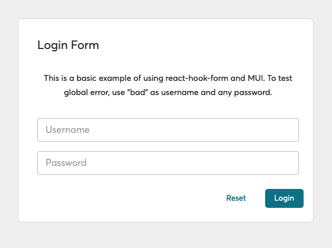

This repo is to show how to use [React Hook Form](https://www.react-hook-form.com) with [MUI](https://mui.com) based components.



&nbsp;

# Setup and Run

```bash
pnpm install
```

Then run:

```bash
pnpm dev
```

This example is not calling any real API. The way to mimic the the user has entered an invalid username and or password is to enter `bad` as the username.
